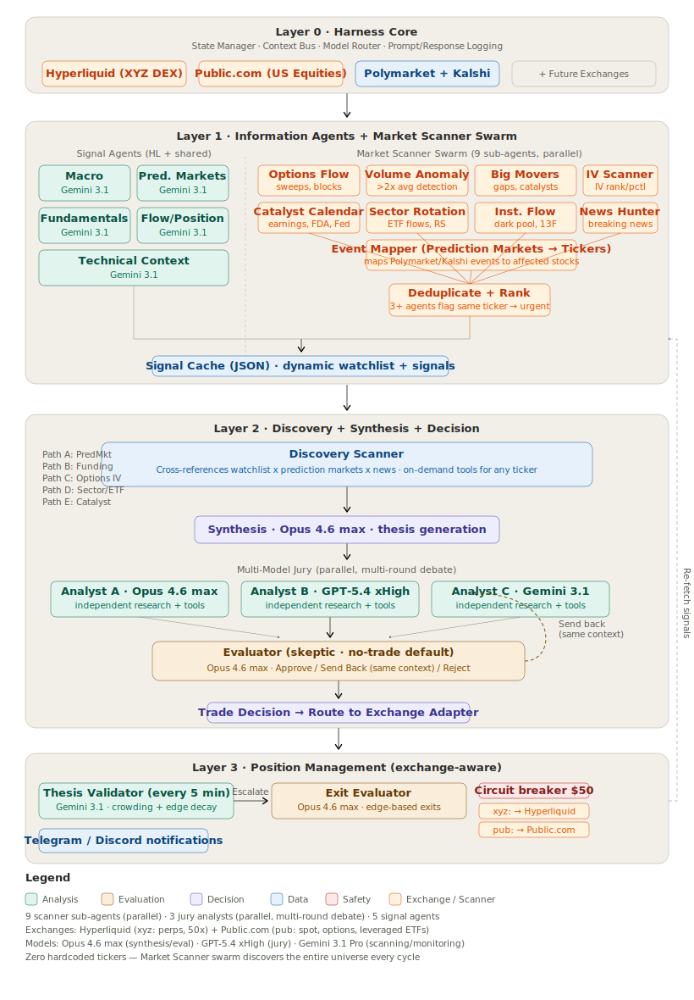

# AI Trading Agent

A fully autonomous multi-model trading harness that discovers, evaluates, and executes trades across [Hyperliquid](https://hyperliquid.xyz) perpetual futures and [Public.com](https://public.com) US equities/options by finding divergences between prediction market odds and asset pricing.

## Architecture

<p align="center">
  
</p>

## How It Works

The system runs 7 concurrent loops:

```
Layer 1: Information Agents (5 agents → signal cache)
    ↓
Layer 2: Discovery → Synthesis → Multi-Model Jury → Evaluator
    ↓
Layer 3: Execution → Position Monitoring → Exit Management
    ↓
Circuit Breaker (continuous) + Meta-Analysis (weekly)
```

### The Edge

Prediction markets (Kalshi, Polymarket) price discrete events — tariff decisions, rate cuts, regulatory actions — that continuous equity/asset models handle poorly. When Kalshi says 70% chance of event X but the corresponding asset hasn't moved, that's the signal.

### Three-Layer Architecture

**Layer 0 — Harness Core**: File-backed state (atomic JSON writes), per-role context assembly, multi-provider model router, full prompt/response logging.

**Layer 1 — Information Agents**: Five cheap-model agents run every 15 minutes, pre-processing raw data into structured signals:
- Macro Regime — classifies risk-on / risk-off / transitional / crisis
- Prediction Markets — extracts actionable signals, flags anomalies (>15% odds shift)
- Earnings & Fundamentals — upcoming earnings, analyst revisions
- Flow & Positioning — funding rate anomalies, crowding detection
- Technical Context — price momentum, volume classification

**Layer 2 — Synthesis & Decision**:
- Discovery scanner reads cached Layer 1 signals + live data
- Synthesis agent generates a thesis with concrete falsification conditions
- Multi-model jury (3 analysts in parallel) produces independent analyses
- GAN-inspired evaluator grades on 5 criteria (thesis quality, falsification specificity, information completeness, risk/reward, edge decay)
- Evaluator can APPROVE, SEND_BACK (for re-analysis), or REJECT

**Layer 3 — Position Management**:
- Continuous thesis validation (cheap model, every 5 min)
- Escalation to frontier model on anomaly detection
- Exit based on edge decay, not price movement
- Circuit breaker at configurable equity floor

### Multi-Model Routing

| Role | Model | Why |
|------|-------|-----|
| Discovery, Monitoring | Gemini 3.1 Pro | Cheap — runs every 5-15 min |
| Analyst B | GPT-5.4 (xHigh) | Epistemic diversity |
| Synthesis, Analyst A, Evaluator, Exit | Claude Opus 4.6 (max effort) | Frontier reasoning |

All models are swappable via environment variables. The harness is model-agnostic.

### No-Trade as Default

Being flat is the correct default state. Every agent prompt enforces this:
- Discovery returns empty candidates when nothing qualifies
- Synthesis defaults to no-trade unless specific, measurable edge exists
- Evaluator rejects >60% of proposals by design
- No mechanism penalizes inaction

### Autonomous Operation

The LLM has full discretion over sizing, leverage, and position count. The only hard constraint is the circuit breaker — protects the experiment, not the LLM's judgment. The `placeOrder` tool requires a `riskReasoning` parameter that gets logged for meta-analysis.

## Tool Registry

The harness provides 15+ tools scoped per agent role:

| Category | Tools |
|----------|-------|
| Market Data | refreshXYZAssets, getFundingRates, getMacroIndicators |
| Prediction Markets | searchPolymarket, getEventEquityMapping (LLM-powered) |
| Research | web_search (Claude native), fetchWebPage, getEarningsCalendar |
| Portfolio | getPortfolioState, getTradeHistory |
| Computation | runSimulation (Python sandbox: numpy, pandas, scipy) |
| Execution | placeOrder (with riskReasoning), closePosition, setStopLoss |
| Built-in | readFile, listFiles, grepFiles, bash (read-only, sandboxed) |

Agents only see tools relevant to their role. Discovery can't execute. The executor can't analyze.

## Data Sources

All public APIs — no auth required for market data:
- **Hyperliquid XYZ DEX** — 59 assets: 34 stocks (NVDA, TSLA, AAPL...), 9 commodities, 5 indices, 3 FX
- **Kalshi** — 88+ economic/political prediction markets (Fed decisions, tariffs, elections)
- **Polymarket** — 97+ events via gamma API (crypto, finance, geopolitics)

## Setup

```bash
git clone https://github.com/Gajesh2007/ai-trading-agent-v2.git
cd ai-trading-agent-v2
npm install
cp .env.example .env
# Add your API keys to .env
npm start
```

### Required

Only one thing:
```
ANTHROPIC_API_KEY=your-key
```

### Optional (enhances the system)

```
OPENAI_API_KEY=       # GPT-5.4 for jury diversity
OPENROUTER_API_KEY=   # Gemini for cheap agents

TELEGRAM_BOT_TOKEN=   # Trade notifications
TELEGRAM_CHAT_ID=
DISCORD_WEBHOOK_URL=

KALSHI_API_KEY=       # Additional prediction market data (works without it)

HL_PRIVATE_KEY=       # Only for live trading
HL_WALLET_ADDRESS=
```

### Paper Trading (Default)

The system starts in paper trading mode. All data is real — prices, prediction markets, web searches, LLM reasoning. Only execution is simulated.

```
PAPER_TRADING=true          # Default
PAPER_STARTING_EQUITY=200   # Virtual starting capital
```

Paper equity persists across restarts. To go live: `PAPER_TRADING=false` + add Hyperliquid keys.

## State & Logging

Everything is written to disk:

| File | What |
|------|------|
| `workspace/state/discovery-candidates.json` | Latest discovery scan |
| `workspace/state/cycle-summaries.jsonl` | Full pipeline per candidate |
| `workspace/state/thesis-registry.json` | All theses |
| `workspace/state/positions.json` | All positions |
| `workspace/state/decisions-log.jsonl` | Every trade decision |
| `workspace/state/paper-equity.json` | Persisted equity |
| `workspace/state/signal-cache/*.json` | Layer 1 agent outputs |
| `workspace/progress.md` | Human-readable session log |
| `logs/discovery-*.jsonl` | Event log |
| `logs/llm-detail-*.jsonl` | Full prompts, responses, tool calls |

## Deploy to Railway

```bash
# Push to GitHub, then in Railway:
# 1. New Project → Deploy from GitHub
# 2. Add Volume at /app/workspace
# 3. Add Volume at /app/logs  
# 4. Set environment variables
# 5. Deploy
```

The Dockerfile includes Python + numpy/pandas/scipy for the simulation tool. `restart: always` policy recovers from crashes.

## Architecture Principles

Drawn from [Anthropic's harness design research](https://www.anthropic.com/engineering/harness-design-long-running-apps), [OpenAI's harness engineering](https://openai.com/index/harness-engineering/), and the [TradingAgents framework](https://arxiv.org/abs/2412.20138):

1. **The harness determines the outcome, not the model** — models are replaceable components
2. **Generator-evaluator separation** — self-evaluation is broken; use a separate skeptical evaluator
3. **Quick-think / deep-think split** — cheap models for data processing, frontier models for decisions
4. **Externalized file-backed state** — survives crashes and context resets
5. **Exit based on edge, not price** — "does the information edge still exist?" not "has the price moved?"
6. **Tool availability scoped per role** — agents only see what they need

## Tech Stack

- TypeScript + [Vercel AI SDK v6](https://ai-sdk.dev) (multi-provider: Anthropic, OpenAI, OpenRouter)
- [@nktkas/hyperliquid](https://github.com/nktkas/hyperliquid) (exchange integration)
- Kalshi public API + Polymarket gamma API (prediction markets)
- Claude native web search (zero-config for Anthropic models)
- File-backed JSON state with atomic writes + mutex locking
- No frameworks (LangChain, etc.) — custom orchestration for full control

## License

Proprietary. All rights reserved.
